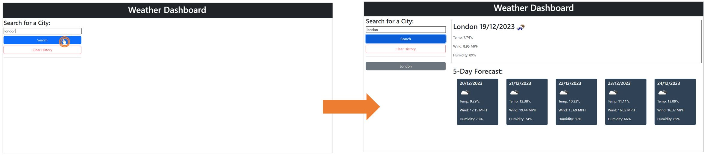
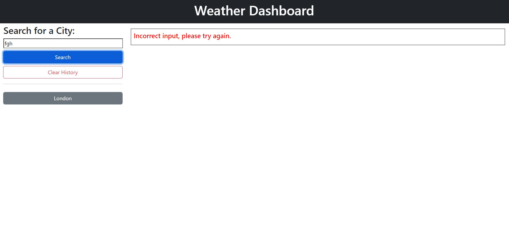
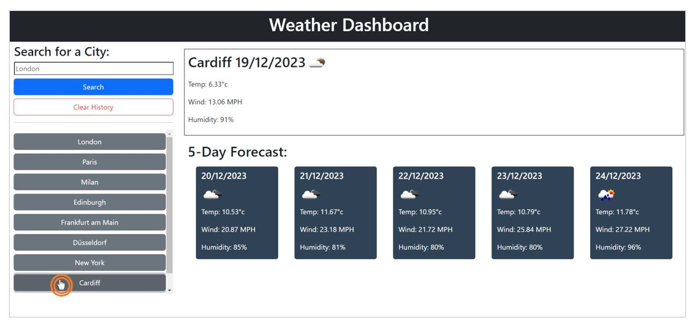
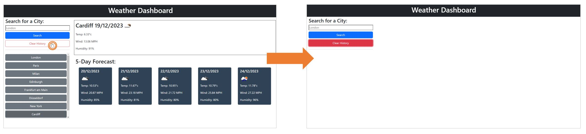

# Weather Dashboard

## Description

As traveller, I'd like to be able to look at the forecast of any city to allow me to decide where to travel to.

This weather app has been achieved by:
* Using a weather API to pull weather forecast data and present it on this app.
* When the user searches a city, the forecast for that city is shown:  
* If the user inputs a word that is incorrect, an error message is shown: 
* As the user searches cities, these cities are added to a history list which will allow the user to click on a previously searched city to bring up that cities forecast. The history list will start to scroll if there are lots of cities in the history: 
* The history is saved to local storage so that it comes back up when the user refreshes or closes & reopens the page.
* If the user would like to clear their history, they can click 'clear history' which will also clear local storage.  

## Installation

Please use the following link to access the website: https://this-girl-shall-code.github.io/weather-dashboard/

## Usage

This application will be used by people wanting to check the weather forecast in cities across the world. 

## Skills

* HTML
* CSS
* Bootstrap
* JavaScript
* jQuery
* Day.js
* Server API
* Local Storage
